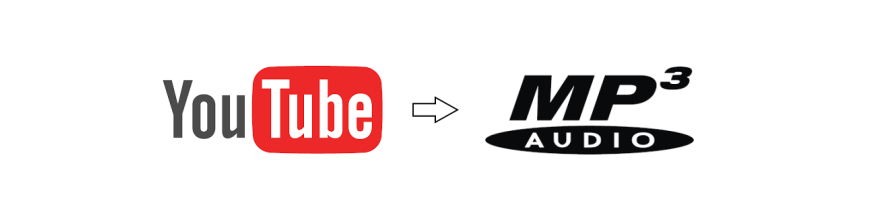

# Music

```Dockerfile
 docker build --tag music .
 docker run -it -v $(pwd)/output:/output music
```

# Tools

* [youtube-dl](https://ytdl-org.github.io/youtube-dl/download.html)
* [id3tool](http://nekohako.xware.cx/id3tool/) 
* [ffmpeg](https://ffmpeg.org/)

# Extract MP3 from YouTube video

```bash
youtube-dl --extract-audio --audio-format mp3 --output /output/<mp3-file.mp3> <video URL>
```

# Change the MP3 ID Meta Data

```bash
id3tool --set-title="To Be Or Not To Be"  --set-artist="Mel Brooks" /output/<mp3-file.mp3>
```
